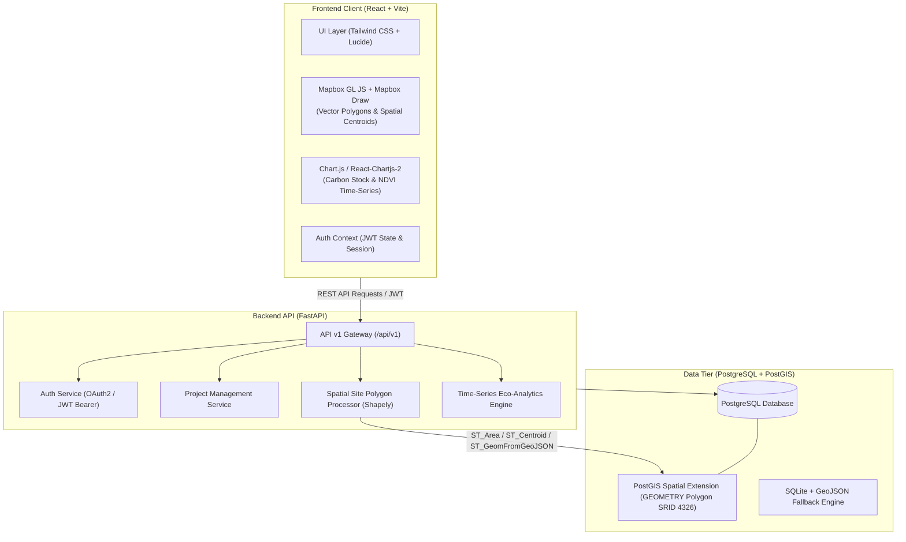
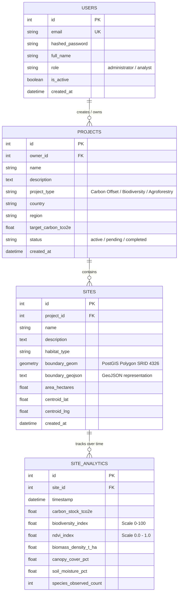

# Darukaa.Earth — Full-Stack Geospatial Data Analytics Platform

[](https://jayghadiya09.github.io/darukaa-earth/)
[](https://github.com/jayghadiya09/darukaa-earth/actions)
[](LICENSE)
[](frontend/)
[](backend/)

> **Darukaa.Earth** is an enterprise-grade geospatial analytics dashboard designed to monitor, analyze, and visualize ecological restoration, carbon offset projects, and biodiversity conservation zones in real time.
>
> 🌐 **Live Demo URL**: [https://jayghadiya09.github.io/darukaa-earth/](https://jayghadiya09.github.io/darukaa-earth/)

---

## 1. System Architecture



### High-Level Architecture Components
- **Frontend (React 19 + Vite 8)**: Fast single-page application styled with Tailwind CSS, leveraging Mapbox GL JS & `@mapbox/mapbox-gl-draw` for geospatial vector polygon capture, and `chart.js` + `react-chartjs-2` for multi-axis ecological analytics.
- **Backend (Python 3.12 / 3.14 + FastAPI)**: High-performance asynchronous API architecture with dependency injection, JWT OAuth2 authentication (`python-jose`, `passlib`, `bcrypt`), and automated Swagger (`/docs`) & ReDoc (`/redoc`) generation.
- **Database (PostgreSQL 16 with PostGIS 3.4)**: Production spatial database storing project boundaries in `geometry(Polygon, 4326)` with automated geodesic area calculations (via `ST_Area(geog) / 10000.0` or `shapely` spherical approximations) and spatial indexing. Includes automated zero-configuration SQLite fallback for rapid local test execution.

---

## 2. Database Schema

The platform utilizes a normalized relational schema with spatial capabilities:



---

## 3. Local Setup and Installation

### Prerequisites
- [Docker & Docker Compose](https://www.docker.com/) (Recommended) **OR**
- Python 3.11+ & Node.js 18+

---

### Option A: Running with Docker Compose (Recommended)
This spins up PostgreSQL + PostGIS along with the FastAPI backend:

```bash
# Clone the repository
git clone https://github.com/jayghadiya09/darukaa-earth.git
cd darukaa-earth

# Start PostGIS and Backend API
docker compose up -d

# Start Frontend Dev Server
cd frontend
npm install
npm run dev
```
- Frontend: `http://localhost:5173`
- Backend API & Interactive Docs: `http://localhost:8000/docs`

---

### Option B: Standalone Local Setup (Without Docker)

#### 1. Backend Setup
```bash
cd backend

# Create and activate virtual environment
python3 -m venv venv
source venv/bin/activate  # On Windows: venv\Scripts\activate

# Install dependencies
pip install -r requirements.txt

# Run migrations/seed and start development server
# (Uses SQLite fallback darukaa_dev.db automatically if no PostgreSQL is configured)
uvicorn app.main:app --host 0.0.0.0 --port 8000 --reload
```
API will run at: `http://localhost:8000` (API Docs: `http://localhost:8000/docs`)

#### 2. Frontend Setup
```bash
cd frontend

# Install dependencies and set up hooks
npm install

# Start Vite development server
npm run dev
```
Frontend will be accessible at: `http://localhost:5173`

---

## 4. Default Seed Accounts & Demo Data

The application automatically provisions default administrator accounts and realistic ecological restoration sites on first startup:

| Role | Email | Password |
| :--- | :--- | :--- |
| **Administrator** | `admin@darukaa.earth` | `admin123` |
| **Demo User** | `analyst@darukaa.earth` | `analyst123` |

### Pre-loaded Conservation Projects:
1. **Western Ghats Biodiversity Corridor** (India) — Tropical Moist Deciduous & Montane Rainforest.
2. **Sundarbans Mangrove Blue Carbon Reserve** (India/Bangladesh) — Tidal Mangrove ecosystem with high carbon sequestration metrics.
3. **Kaziranga Buffer Reforestation Zone** (Assam, India) — Alluvial Grassland & Semi-evergreen corridor.

---

## 5. CI/CD Pipeline & Developer Experience

### 1. Pre-Commit Hooks (Husky & lint-staged)
Code quality is enforced locally on every commit before code reaches git:
- **Husky v9**: Manages native Git hooks located in `.husky/pre-commit`.
- **lint-staged**: Automatically filters staged files and triggers:
  - **Prettier**: Formats all JSX, JS, CSS, and HTML code.
  - **Oxlint**: Runs fast multi-threaded linter enforcing React Compiler rules, hooks rules, and zero unused variables.

```bash
# Manually run lint checks
cd frontend
npm run lint

# Manually verify formatting
npm run format:check

# Format all files
npm run format
```

### 2. GitHub Actions Automated Pipeline (`.github/workflows/ci.yml`)
Every push and pull request to `main` runs automated CI jobs:
1. **Backend Testing Job (`backend`)**:
   - Python 3.12 environment
   - Dependency caching
   - Pytest execution against isolated test database covering Auth, Projects, Polygon creation, and Analytics.
2. **Frontend Quality & Build Job (`frontend`)**:
   - Node 22 environment
   - Dependency caching (`npm ci`)
   - Automated lint validation (`oxlint`)
   - Prettier style validation (`prettier --check`)
   - Production Vite bundle build (`npm run build`)
3. **Continuous Deployment Trigger (`deploy-hint`)**:
   - Integrates with Vercel and Render Webhook / Git synchronization.

---

## 6. Live Deployment Configurations

### Frontend Deployment (Vercel)
- Configured via `frontend/vercel.json` with client-side SPA rewrites:
  ```json
  {
    "rewrites": [{ "source": "/(.*)", "destination": "/index.html" }]
  }
  ```
- Environment Variables:
  - `VITE_API_URL`: URL of the deployed FastAPI backend (e.g., `https://darukaa-earth-api.onrender.com/api/v1`)
  - `VITE_MAPBOX_TOKEN`: Mapbox public access token (optional, falls back gracefully to dark CARTO raster tiles).

### Backend Deployment (Render / Heroku)
- Configured via root `render.yaml` Infrastructure as Code (Blueprint) with managed PostgreSQL database, automatic SSL, and health check monitoring at `/health`.

---

## 7. Key Features Summary

- [x] **JWT Authentication**: User registration, login, token refresh, and protected API routes.
- [x] **Project Management**: Create projects, specify target carbon offset values, view portfolios.
- [x] **Geospatial Mapbox Integration**: Draw boundary polygons directly on the map, calculate acreage in real time, view geographic centroids.
- [x] **Interactive Analytics**: Time-series charts for Carbon Sequestration, Biodiversity Health Index (0-100), NDVI Vegetation scores, and Biomass density.
- [x] **Automated Code Quality**: Husky pre-commit hooks, lint-staged, Prettier, Oxlint, and GitHub Actions CI.
